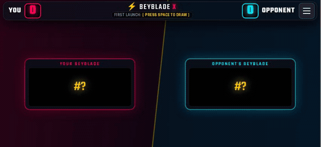
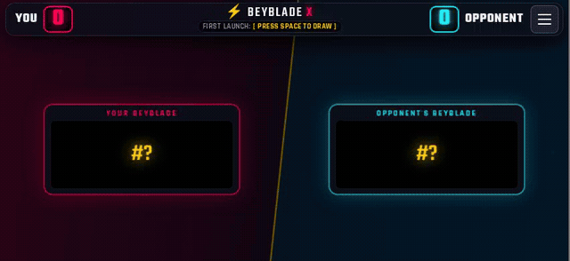

<div align="center">

# X-Drive Arena

**A fullscreen Beyblade X match companion for fast draws, scorekeeping, and dramatic arena victories.**

[](https://github.com/al4xdev/x-drive-arena/releases/latest)
[](#run-the-pwa)
[](https://github.com/al4xdev/x-drive-arena/releases/latest)

<table>
  <tr>
    <th>Score streak and victory</th>
    <th>Double-tap draw</th>
  </tr>
  <tr>
    <td></td>
    <td></td>
  </tr>
</table>

</div>

X-Drive Arena turns a phone into a compact landscape arena display. Draw two numbered Beyblades, decide who launches first, track official-style finish points, and celebrate the winner with an arcade-inspired treasure fountain.

The app is designed for quick local matches. It works as an installable PWA in a browser and as an immersive Android app that uses the entire landscape screen, including the display-cutout area.

## Highlights

- Draws two Beyblade numbers with an animated dual roulette.
- Prevents duplicate draws when that option is enabled.
- Tracks Spin (+1), Burst (+2), Over (+2), and Xtreme (+3) finishes.
- Reveals scoring controls by holding a player card on touch devices.
- Requires a deliberate double tap to start a draw on touch screens.
- Shows score streaks, match point feedback, particles, and a full victory sequence.
- Stores settings, match state, and draw history locally.
- Supports English and Brazilian Portuguese.
- Works offline after the PWA assets have been cached.
- Runs fullscreen in landscape on Android.

## Controls

| Action | Touch | Desktop |
| --- | --- | --- |
| Draw Beyblades | Double tap an empty arena area | Click the arena or press `Space` |
| Reveal scoring | Press and hold a player card | Hover over a player card |
| Add red-side points | Tap a finish after holding the card | `Q`, `W`, `E`, or `R` |
| Add blue-side points | Tap a finish after holding the card | `U`, `I`, `O`, or `P` |
| Undo the last score | Open the menu and select Undo | Press `Z` |

Tapping outside an open scoring panel closes it without accidentally starting the roulette.

## Install on Android

1. Open the [latest release](https://github.com/al4xdev/x-drive-arena/releases/latest).
2. Download `X-Drive-Arena-v1.0.0.apk`.
3. Allow your browser or file manager to install apps from that source when Android asks.
4. Open X-Drive Arena and rotate the phone to landscape.

The release APK supports Android 7.0 and newer. It is a sideload build, so Android may display its standard unknown-source warning during installation.

## Run the PWA

Requirements: Node.js 20 or newer and npm.

```sh
npm ci
npm run dev -- --host
```

Open the local network URL printed by Vite on your phone. In a supported browser, use **Install app** or **Add to Home screen** to install the PWA.

To test a production build:

```sh
npm run build
npm run preview -- --host
```

## Build the Android APK

Requirements: Node.js 20 or newer, JDK 21, and an Android SDK with API 36.

```sh
npm ci
npm run build
npx cap sync android
cd android
./gradlew assembleDebug
```

The APK is generated at:

```text
android/app/build/outputs/apk/debug/app-debug.apk
```

## Project layout

| Path | Purpose |
| --- | --- |
| `src/` | Arena controllers, state, audio, particles, translations, and styles |
| `android/` | Capacitor Android project and immersive fullscreen integration |
| `public/` | PWA manifest, service worker, and static assets |
| `docs/` | README demonstration media |
| `index.html` | Main arena interface |

## Disclaimer

X-Drive Arena is a fan-made companion and is not affiliated with or endorsed by Takara Tomy, Hasbro, or their partners. Beyblade and Beyblade X are trademarks of their respective owners.
